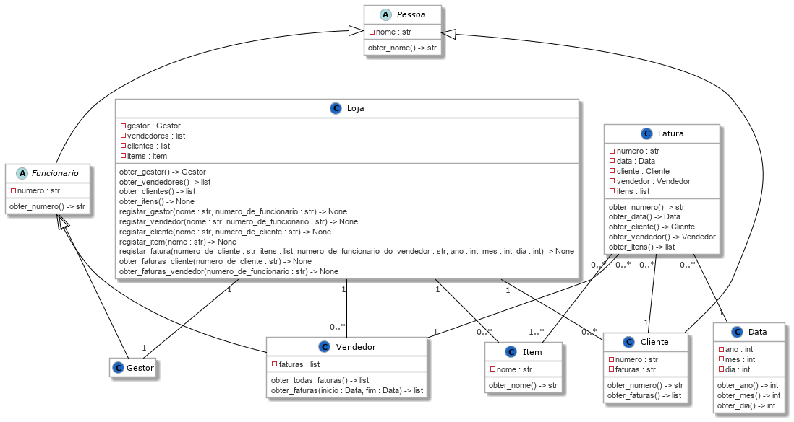

# [Algoritmos e Estruturas de Dados 2020 2021](https://elearning.ual.pt/course/view.php?id=1787) - [UAL](https://autonoma.pt/)

## Laboratório 1

### Descrição
Considere o seguinte diagrama de classes:



O diagrama descreve uma loja onde clientes podem efetuar compras. Uma compra é representada por uma fatura com um ou mais itens.

Os métodos de `Loja` têm a seguinte interpretação:

- `obter_gestor() -> Gestor`
  - Retorna o gestor da loja. Quando a loja é criada, este objeto não existe.
- `obter_vendedores() -> list`
  - Retorna a lista de objetos `Vendedor` da loja.
- `obter_clientes() -> list`
  - Retorna a lista de objetos `Cliente` da loja.
- `obter_items() -> list`
  - Retorna a lista de objetos `Item`.
- `registar_gestor(nome : str, numero_de_funcionario : str) -> None`
  - Cria um novo objeto `Gestor`, que passa a ser o gestor da loja.
- `registar_vendedor(nome : str, numero_de_funcionario : str) -> None`
  - Cria um novo objeto `Vendedor`, e regista-o na lista.
- `registar_cliente(nome : str, numero_de_cliente : str) -> None`
  - Cria um novo objeto `Cliente`, e regista-o na lista.
- `registar_item(nome : str) -> None`
  - Cria um novo objeto `Item`, e regista-o na lista.
- `registar_fatura(numero_de_cliente : str, itens : list, numero_de_funcionario_do_vendedor : str, ano : int, mes : int, dia : int) -> None`
  - Cria um novo objeto `Fatura`, com os objetos `Cliente` e `Vendedor` relativos aos números indicados, com um objeto `Data` com os parâmetros indicados, e regista-o na lista.
- `obter_faturas_cliente(numero_de_cliente : str) -> list`
  - Retorna a lista de objetos `Fatura` do cliente com o número indicado.
- `obter_faturas_vendedor(numero_de_funcionario : str) -> list`
  - Retorna a lista de objetos `Fatura` associados ao vendedor o número indicado.

### Tarefas
- Implemente as classes do diagrama.
  - Todas as classes devem ser definidas em módulos com o mesmo nome, e todos os módulos pertencem ao *package* `lab1`.
    - Estrutura:
      - `src\lab1\loja.py`
      - `src\lab1\item.py`
      - `src\lab1\pessoa.py`
      - `src\lab1\funcionario.py`
      - `src\lab1\gestor.py`
      - `src\lab1\cliente.py`
      - `src\lab1\vendedor.py`
      - `src\lab1\fatura.py`
      - `src\lab1\data.py`
- Todos os métodos descritos no diagrama devem ser implementados.
  - Podem ser implementados mais métodos, se forem considerados necessário.
- É necessário implementar uma interface de linha de comandos.
  - As instruções desta interface não se encontram especificadas.
- É necessário passar os testes da classe `Loja` disponíveis em `src\tests\test_loja.py`.
  - Para executar:

    ```bash
    cd src
    python -m unittest tests.test_loja
    ```

  - Não é permitido alterar os métodos de teste disponibilizados.
  - Podem ser acrescentados mais testes, e outras classes de teste.

### Datas

| Evento                        | Data                 |
| ----------------------------- | -------------------- |
| Disponibilização de enunciado | 28/03/2021           |
| Entrega                       | 11/04/2021, 23:59:59 |


### Regras
- O trabalho deve ser realizado em grupo, previamente registado no *e-learning*.
- O código produzido deverá estar disponível no repositório GitHub gerado pelo GitHub Classroom.
  - Podem ser criados vários *branches*, de acordo com o organização que o grupo de trabalho considerar mais conveniente.
  - Deve sempre existir um *branch* `main`, onde a versão final deverá ficar disponível.

### Entrega
A versão final do trabalho deve estar disponível na *branch* `main` do repositório até à hora limite de entrega. <span style="color: red">Não serão considerados *commits* com data posterior à data limite.</span>

A entrega deve também ser feita no *e-learning*, num ficheiro `zip` com todo o projeto.
